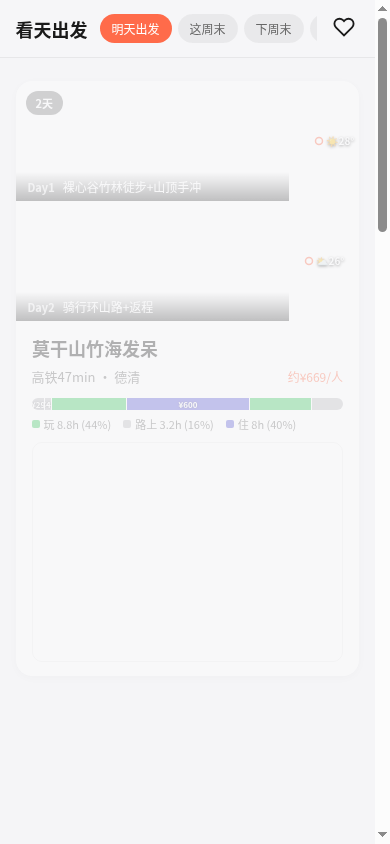
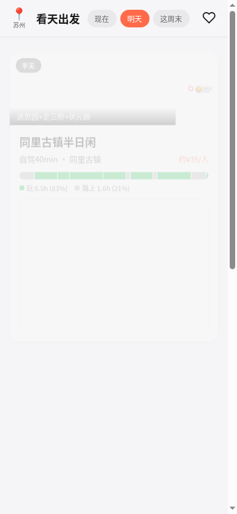
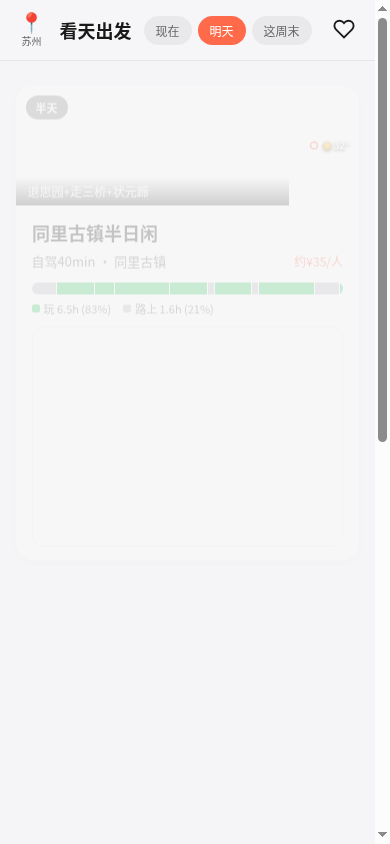
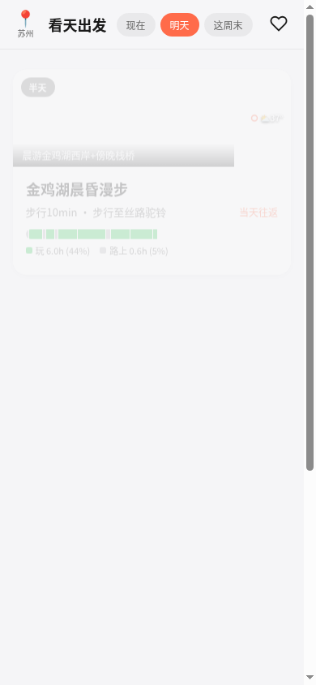
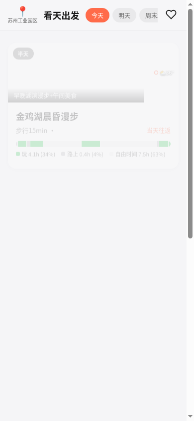
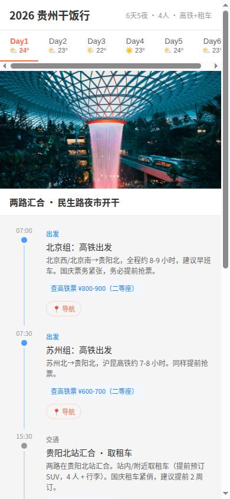
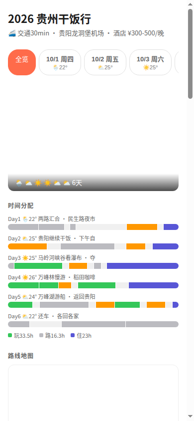

# Kantian Travel — Product Reflection

> 2026-07-26. A retrospective after a full product iteration cycle.

## Conclusion

**Travel planning as a standalone product probably doesn't stand on its own.**

## Why

### Breaking Down the Core Actions of Travel Planning

1. **Discovery / Inspiration** — "I want to go there" → Already solved by Xiaohongshu (photos + videos + real experiences)
2. **Decision-making** — Weather, transport, accommodation → Experienced travelers do this in 15 minutes
3. **Execution / Navigation** — How to get around once there → Already solved by Amap / Google Maps
4. **Booking** — Flights, hotels, tickets → Already solved by Ctrip / booking.com

"Planning" sits between steps 1-4, and each step is already well-served by existing tools. The planning layer itself is too thin to support a product.

### What Actually Drives Inspiration

People get inspired on Xiaohongshu through **visual impact — photos and videos**, not text.

There are only three paths for imagery, each with a fatal flaw:
- **Real user photos (Xiaohongshu)** — Both authentic AND beautiful (people choose angles, add filters), but it's other people's content
- **Google Places** — Authentic but ugly (random tourist snapshots), doesn't make you want to go
- **AI-generated** — Beautiful but fake, you arrive and it looks nothing like that, trust collapses

Xiaohongshu found the intersection of "authentic" and "attractive." We can't replicate this.

### Why AI-Generated Travel Content Doesn't Work

- No one gets inspired to visit a place because of AI-generated text
- Inspiration is fundamentally about trust transfer: I trust this person's taste → so I want to go where they recommend
- AI has no taste, no real experience, can't write content that makes people feel something
- Market validation: not a single AI travel planning product has become beloved

### Planning Itself Is Not a Pain Point

For anyone who's done it a few times, trip planning is three steps:
1. Check weather (can I go?)
2. Check transport (how do I get there?)
3. Book accommodation

Everything else (where to eat, what to explore, which route to walk) you figure out on the ground. Pre-planned itineraries change the moment you arrive anyway.

## What Travel Planning Products Are Doing

| Type | Examples | What They Do | Problem |
|------|----------|--------------|---------|
| AI itinerary generation | Roam Around, Layla, TripGenie | Input "Guizhou 6 days" → output full itinerary | Content has no inspirational power; users still verify on Xiaohongshu |
| Itinerary editors | Wanderlog, Qiongyou Planner | Drag POIs onto calendar, auto-calculate routes | More complex than just listing in a notes app; tool is heavier than the problem |
| Booking aggregators | TripIt, Google Travel | Auto-organize confirmation emails into timeline | Has value but low ceiling; solves "viewing" not "planning" |
| Platform add-on features | Ctrip "smart itinerary", Fliggy | Add "plan your trip" in booking flow | Fundamentally a sales funnel — recommends products with commission |

**Common problems across all:**
- All try to productize "planning" as an action, but users don't feel planning needs a tool
- All try to replace "browsing Xiaohongshu" but can't match its inspirational content
- All get used once before departure and never opened again
- All treat "the itinerary" as core deliverable, but itineraries break on contact with reality

## Our Iteration Journey (181 commits)

### Phase 1: H5 Prototype

- Basic page + GitHub CI auto-deploy to VM1
- Day views, Amap navigation buttons, related content display
- Map auto-draws route lines from step coordinates

### Phase 2: UI Polish (~25 commits)

- Vertical timeline + proportional connector lines (2h activity line longer than 30min transit)
- Step display: accordion → always expanded → horizontal buttons
- Detail page tabs show real dates (7/24 Thu) instead of Day1
- "Prep reminder" cards at bottom of each day (hiking tomorrow → wear sneakers)
- Settings panel: switch cities, switch tag preferences
- Map layer toggles (accommodation/play/transit shown separately)
- Fixed 89 duplicate coordinates, Gantt chart Chinese encoding bugs
- Mobile width adaptation (max-width 430px)

### Phase 3: "Follow Along" Feature (~15 commits)

- Plans go from "view" to "executable instances"
- Swipe left👍 / right👎 → eventually replaced with vote buttons
- Support adding/deleting steps + time picker
- Floating quick-entry button (tried 🐾→🦶→👣)
- Full-screen follow-along view + route map
- Saved list shows trip instances, can "do it again"
- **Reflection**: Built heavy interaction, but users don't actually check-in step-by-step while traveling

### Phase 4: Data Schema Design (~8 commits)
- Summarized DATA-SCHEMA after two days of prototype iteration
- Core decision: step is the single source of truth, card fields computed from steps
- time → startTime + endTime, cost attached to bookings
- Removed plan.route, map derives from steps[].place

### Phase 5: Generation Pipeline (~20 commits)

- `generate.js` five generations (v1→v2→v3→v4→v5)
- v3: full pipeline knowledge/ → API → LLM → output, single command
- v4: introduced Step 0 (model-driven search strategy), LLM decides what to search
- v5: smart POI filter (dead malls filtered out), route validation, cost verification
- POI coordinate coverage: 15% → 56% → 73% → 97% → 100%
- Amap keygate proxy (don't expose API key)
- Tags evolved: today/tomorrow/weekend → saturday/sunday/weekend-2-days
- Plan count: 14 → 20 → 21

### Phase 6: Photo Integration (8 commits)

- Deployed Google Places Photo Proxy to VM1
- First batch of real photos: 11/24 days had images
- Search by actual POI name: 17/24 → 19/24
- Found problem: Japanese shrine showing up in Suzhou plans → cleaned
- Fallback: use Jinji Lake photo for plans without images
- Tried Unsplash matching by activity keywords
- **Final approach**: Google Places first, Unsplash fallback
- **Reflection**: Google Places photos are too ugly (random tourist shots), zero inspirational power

### Phase 7: Product Direction Documentation (~8 commits)
- PRODUCT.md rewritten multiple times
- Core formula established: destination knowledge × real-time conditions × user needs
- Slogan confirmed: "此刻合适，也适合你" (Right now, right for you)
- Three-layer architecture: static knowledge + real-time data + user constraints
- Distribution model: city×tag pre-generation + CDN cache
- Tech stack chosen: PostgreSQL + PostGIS
- Validated direction using real Xiaohongshu user questions
- Two-model-call architecture (lightweight search strategy + heavyweight plan generation)

### Phase 8: LLM Quality Grind (~8 commits before pivot)

- Switched models: GPT-5.5 → GPT-5.6-sol (stronger reasoning)
- Trip continuity enforcement (overnight trips can't go home mid-trip)
- Multi-transport costs written into prompt
- Experience type diversity (ancient towns/lake views/rafting/mountains)
- Final version: 20 plans, tagged **v0.1.0-alpha**
- **Reflection**: No matter how much we tuned prompts and models, generated content had zero inspirational power

### Phase 9: Pivot — User Content + AI Organization (today, morning)

- Core insight: good content comes from humans, AI's value is in organization not generation
- User throws screenshots → multimodal extraction → Amap API verification → plan page
- Guizhou trip MVP: 10 screenshots → 6-day complete plan
- Real Xiaohongshu links, historical weather (Open-Meteo), precise coordinates
- Channel as product: #kantian-travel itself is the entry point

### Phase 10: Reflection — The Category Itself (today, afternoon)

- Travel planning category has a low ceiling
- Inspiration requires visual impact, AI can't deliver
- "Planning" itself takes 15 minutes, not a pain point
- Product direction needs fundamental rethinking

## Valuable Takeaways

The product direction may not hold, but this period wasn't wasted:

1. **"Channel as product"** — Any scenario can be a well-tuned channel, no standalone app needed
2. **Screenshot → structured extraction → executable output** — This capability chain applies beyond travel
3. **Real-time data overlay (weather/transit APIs)** — Where AI genuinely outperforms humans
4. **Understanding AI content generation boundaries** — Knowing what humans should do vs. what AI should do
5. **Complete UI component library** — Gantt charts, timelines, maps, navigation buttons — reusable in the next project
6. **Product judgment heuristic** — Before building, always ask: How do people do this without AI? How long? How painful? If the answer is "15 minutes, not very painful" — don't build it.

## One Line

**Good travel platforms are built on high-quality content, not tool capabilities. AI shouldn't produce content — it should do what humans can't or won't do themselves.**
