# 看天出发 — 产品反思

> 2026-07-26，经过完整的产品迭代后的复盘。

## 结论

**旅行规划作为独立产品可能立不住。**

## 为什么

### 旅行规划的核心动作拆解

1. **发现/种草** — "我想去那里" → 小红书已解决（图片+视频+真人体验）
2. **决策** — 天气、交通、住宿 → 有经验的人 15 分钟搞定
3. **执行/导航** — 到了怎么走 → 高德/Google Maps 已解决
4. **预订** — 机票酒店门票 → 携程/去哪儿已解决

"规划"夹在 1234 中间，每一步都已经被现有工具解决得够好了。中间的规划本身太薄，撑不起一个产品。

### 种草靠的是什么

人在小红书被种草，靠的是**图片和视频的视觉冲击**，不是文字。

图片只有三条路，每条都有硬伤：
- **真实用户拍的（小红书）**— 真实+好看（人会选角度、加滤镜），但这是别人的内容
- **Google Places** — 真实但丑（随机游客拍的），看了不想去
- **AI 生成** — 好看但假，到了发现不一样，信任崩塌

小红书找到了"真实"和"好看"的交集。这个我们复制不了。

### AI 生成旅行内容为什么不行

- 没有人会因为 AI 写的一段文字而种草
- 种草的本质是信任转移：我信任这个人的品味 → 所以他推荐的地方我想去
- AI 没有品味，没有真实体验，写不出让人心动的内容
- 市场验证：没有一个 AI 旅行规划产品让大家觉得好

### 规划本身不是痛点

做惯了之后，旅行规划就三步：
1. 查天气（决定能不能去）
2. 查交通（决定怎么到）
3. 定住宿

其他的（吃什么、逛哪里、走哪条路）到当地都能完美解决。提前规划了到现场也会变。

## 市场上的旅行规划产品在做什么

| 类型 | 代表 | 做的事 | 问题 |
|------|------|--------|------|
| AI 生成行程 | Roam Around, Layla, TripGenie | 输入"贵州6天"→输出完整行程 | 内容无种草力，用户还是要去小红书验证 |
| 行程编辑器 | Wanderlog, 穷游行程助手 | 用户拖 POI 到日历，自动算路线 | 比备忘录列清单还复杂，工具比问题重 |
| 预订聚合 | TripIt, Google Travel | 自动整理确认邮件成时间线 | 有价值但天花板低，解决的是"看"不是"规划" |
| 平台附属功能 | 携程行程规划, 飞猪智能行程 | 预订流程里加"帮你排行程" | 本质是导购，推的是有佣金的产品 |

**共同问题：**
- 都在做"规划"这个动作，但用户不觉得规划需要工具
- 都在试图替代"逛小红书"，但内容没有种草力
- 都是出发前用一次就不再打开
- 都把"行程"当核心交付物，但出了门行程就变

## 我们的迭代路径（181 commits）

### 阶段一：H5 原型搭建

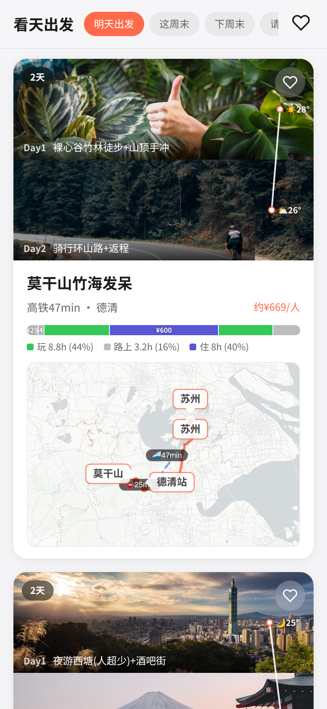
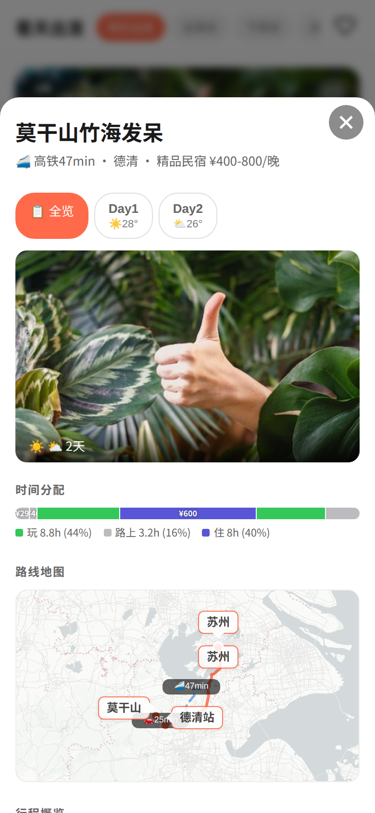

- 基础页面 + GitHub CI 自动部署到 VM1
- 分天视图、高德导航按钮、种草内容展示
- 地图从 steps 坐标自动画路线

### 阶段二：UI 疯狂打磨（~25 commits）

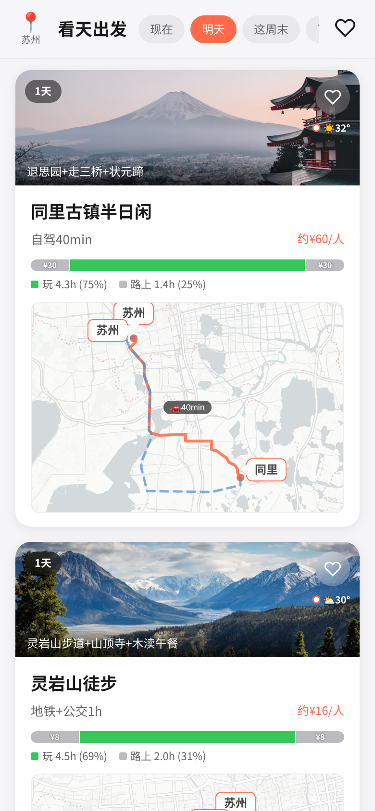
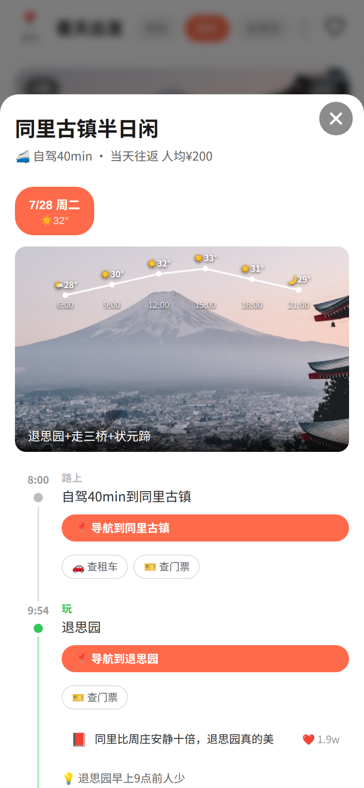

- 时间轴竖向展示 + 按时长比例的连接线（玩 2h 的线比坐车 30min 长）
- 行程步骤：手风琴展开 → 默认展开 → 横排按钮
- 详情页 Tab 显示真实日期（7/24 周四）而非 Day1
- 每天底部加「准备提醒」卡片（明天有徒步→穿运动鞋）
- 设置面板：切城市、切 tag 偏好
- 地图分层切换（住宿/游玩/交通分开显示）
- 修了 89 个重复坐标、甘特图中文乱码
- 手机宽度适配（max-width 430px）

### 阶段三：「跟着走」功能（~15 commits）

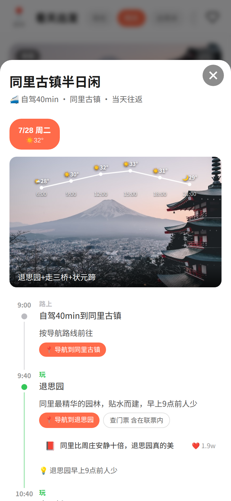

- 方案从「看」变成「执行实例」
- 左滑👍/右滑👎 → 最终改成投票按钮
- 支持增删步骤 + 时间选择器
- 悬浮快捷入口（尝试了🐾→🦶→👣）
- 全屏跟着走视图 + 路线地图
- 收藏列表显示旅行实例，可「再走一次」
- **反思**：做了很重的交互功能，但用户出门后根本不会这样一步步打卡

### 阶段四：数据结构设计（~8 commits）
- 两天原型迭代后总结出 DATA-SCHEMA
- 核心决策：step 是唯一数据源，卡片字段全部从 steps 计算
- time → startTime + endTime，cost 挂在 booking 上
- plan.route 去掉，地图从 steps[].place 推导

### 阶段五：数据生成管线（~20 commits）

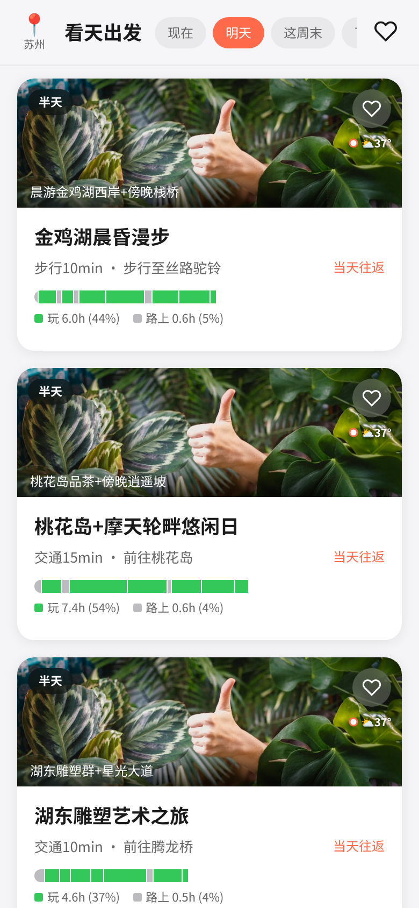
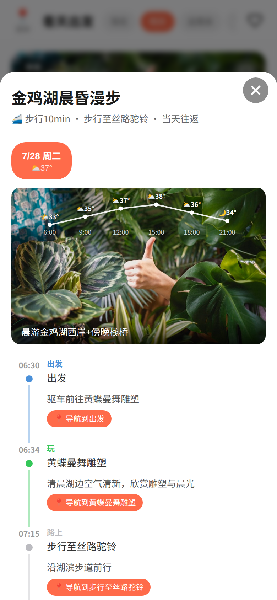
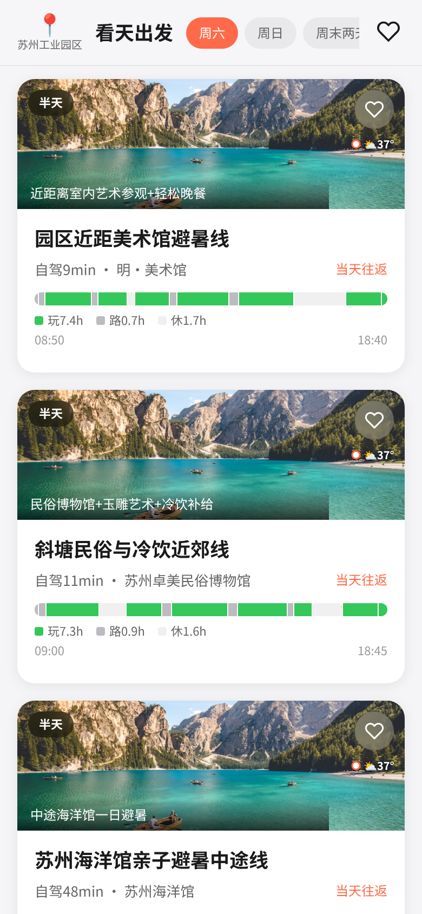
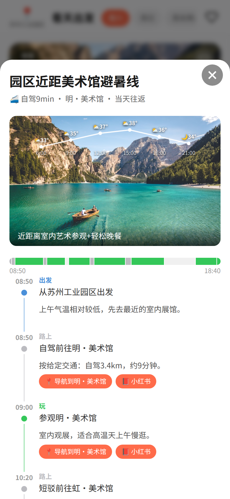

- `generate.js` 五代迭代（v1→v2→v3→v4→v5）
- v3：完整管线 knowledge/ → API → LLM → output，一条命令跑完
- v4：引入 Step 0（模型驱动搜索策略），让 LLM 决定搜什么
- v5：智能 POI 过滤（把死掉的商场过滤掉）、路线校验、费用验证
- POI 坐标覆盖率：15% → 56% → 73% → 97% → 100%
- 高德 keygate 代理接入（不暴露 key）
- tags 演变：今天/明天/周末 → 周六/周日/周末两天
- 方案数量：14 → 20 → 21 个

### 阶段六：图片接入（8 commits）

图片问题是整个项目中最能体现「种草力」瓶颈的环节。经历了 6 个子阶段：

#### 6.1 首批 Google Places 照片（11/24 天有图）

部署 Google Places Photo Proxy 到 VM1，第一次把占位图换成真实照片。

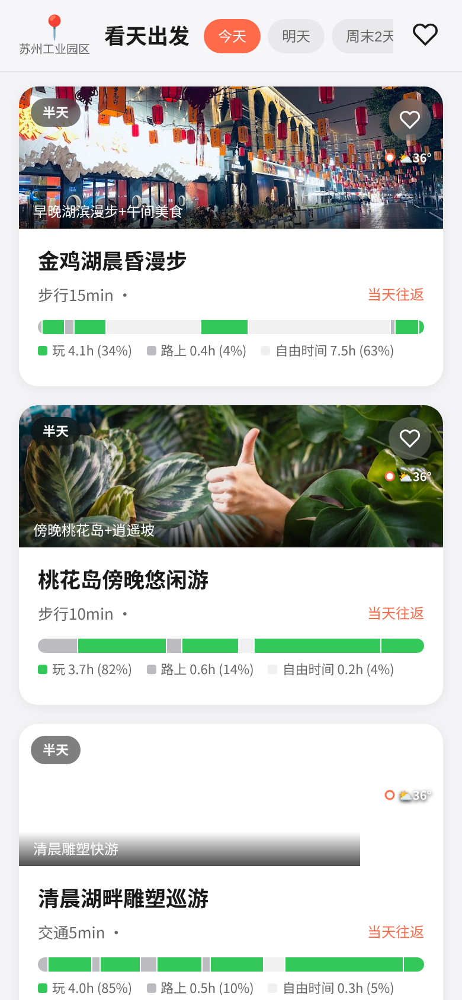
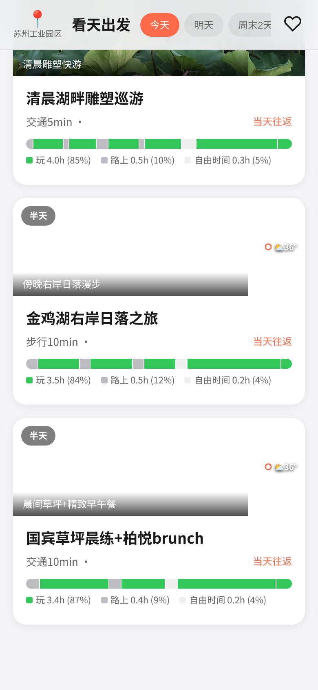
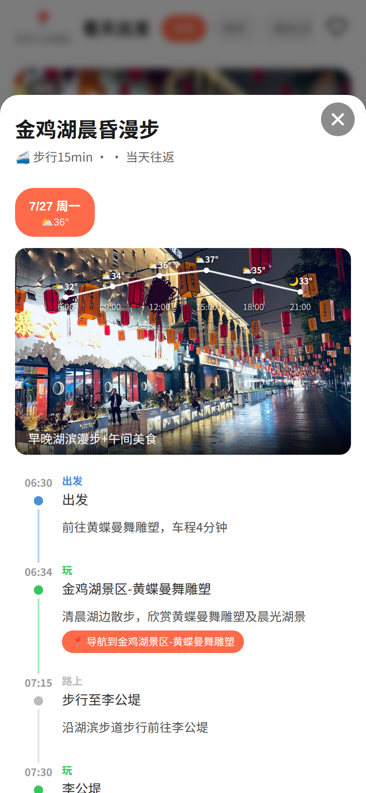

照片来自 Google Places API 随机返回的用户上传图——灯笼街夜景还行，但很多 POI 返回的是游客随手拍的低质量照片，或者干脆没有照片（空白卡片）。

#### 6.2 按实际 POI 名搜索（17/24 → 19/24）

改用行程步骤中的实际地点名去搜索 Google Places，覆盖率从 11/24 提升到 19/24。

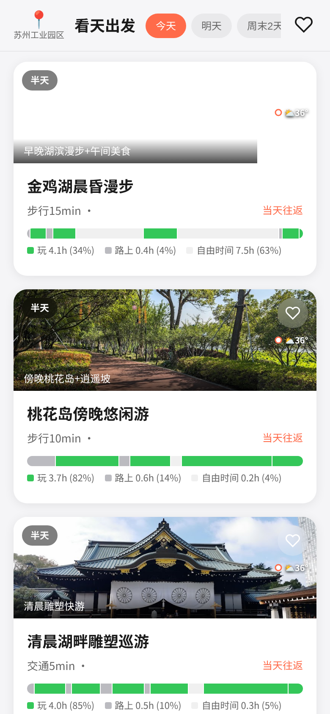
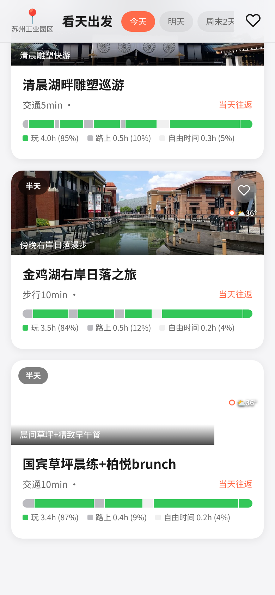
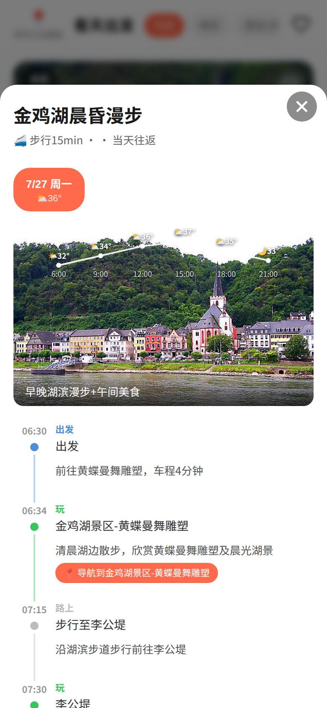

覆盖率提高了，但新问题出现——搜索结果不准，**日本神社出现在苏州方案里**：

#### 6.3 错位照片问题（日本神社 in 苏州）

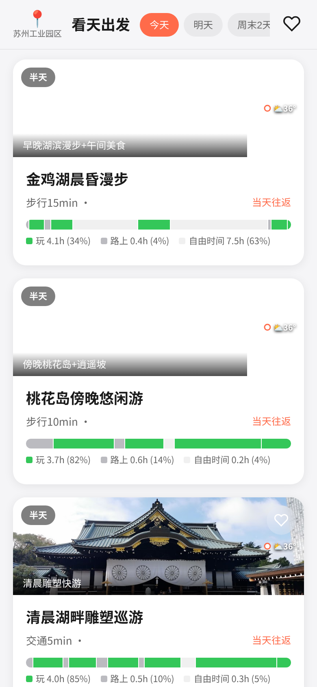
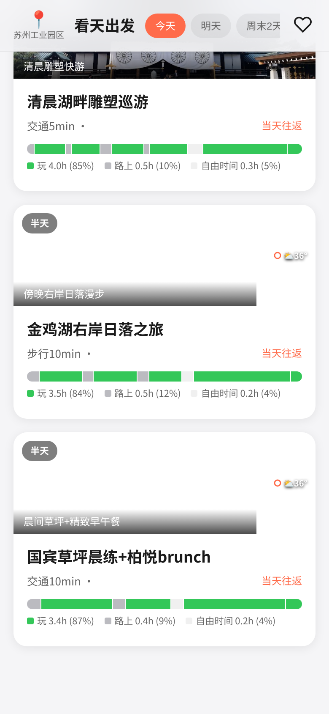

注意第三张卡片「清晨雕塑快游」——配图是日本神社的金色屋顶。这是因为 Google Places API 按关键词搜索时没有地理围栏约束，「雕塑」匹配到了日本的结果。同时第一张卡片照片完全加载失败（空白）。

#### 6.4 清理错位照片

手动清理了所有地理位置不对的照片，没图的先用金鸡湖占位。

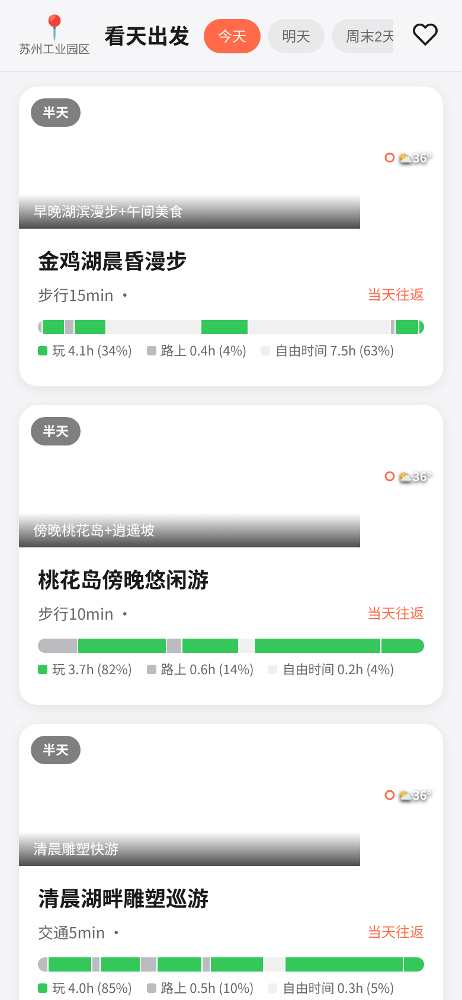
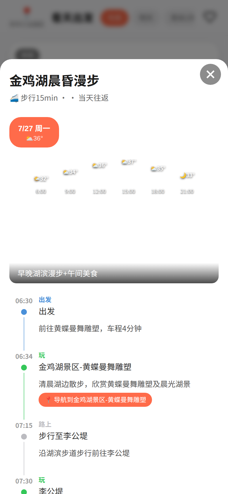

卡片变得干净了，但大量方案失去照片，回到了占位图状态。

#### 6.5 换 Unsplash 高质量图

尝试用 Unsplash API 按活动关键词（hiking、lake、ancient-town）匹配高质量照片。

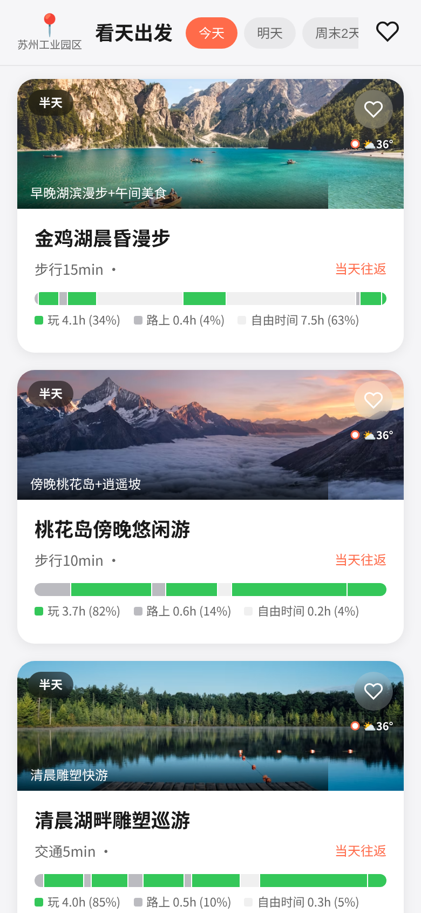
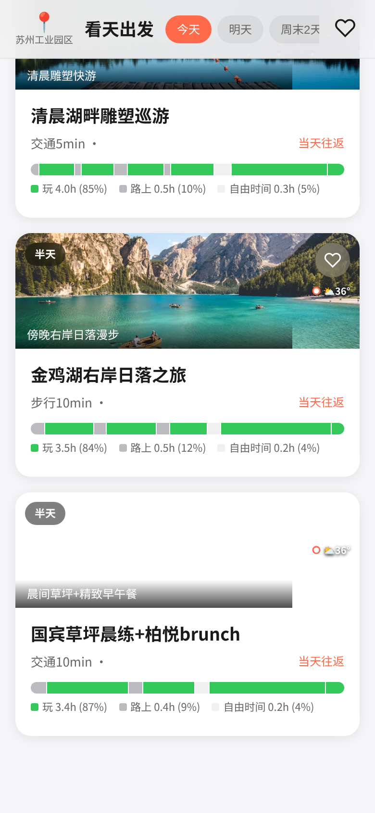
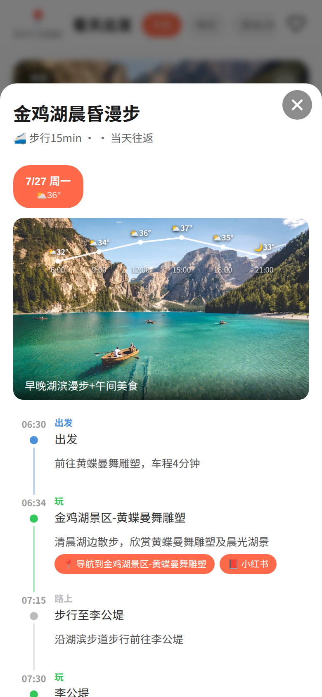

视觉效果大幅提升——每张卡片都有精美的风景照（湖泊、云海、日落）。但问题是：**这些照片跟苏州没有任何关系**。用户看到卡片觉得好看，到了现场发现完全不是那回事。这就是 AI 生成内容的信任问题——好看但假。

#### 6.6 最终方案：Google Places 优先 + Unsplash 兜底

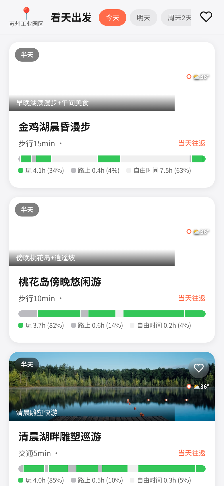
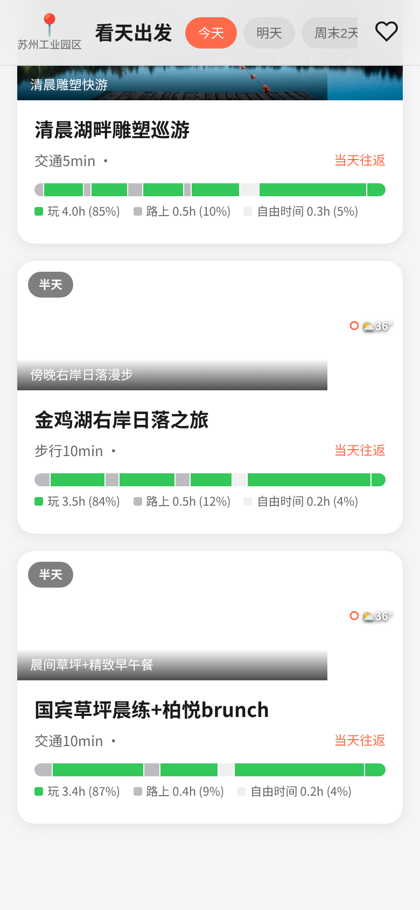
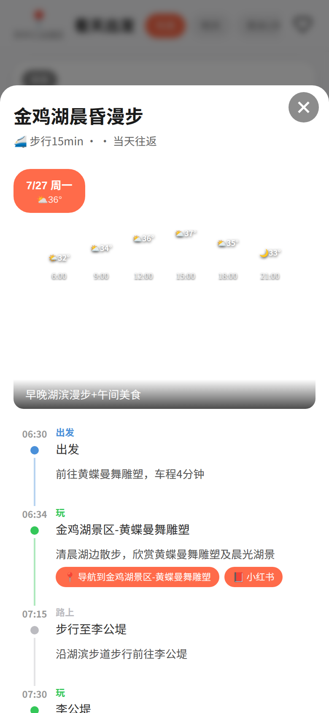

折中方案：有真实 Google Places 照片的 POI 用真实照片，没有的用 Unsplash 兜底。但这个方案本质上没解决核心矛盾——**真实照片不够好看，好看照片不够真实**。

- **反思**：图片问题暴露了整个产品方向的根本矛盾。种草靠的是「真实 + 好看」的交集（小红书用户精心拍的照片），而我们只能在「真实但丑」（Google Places）和「好看但假」（Unsplash/AI）之间二选一。这个问题无解。

### 阶段七：产品方向文档化（~8 commits）
- PRODUCT.md 多次重写
- 核心公式确立：目的地知识 × 目的地实况 × 你的需求
- Slogan 确定：「此刻合适，也适合你」
- 三层架构设计：静态知识 + 实时数据 + 用户约束
- 分发模型：城市×tag 预生成 + CDN 缓存
- 技术选型：PostgreSQL + PostGIS
- 从小红书真实提问验证产品方向
- 两次模型调用架构（轻量搜索策略 + 重量方案生成）

### 阶段八：LLM 质量死磕（~8 commits before pivot）

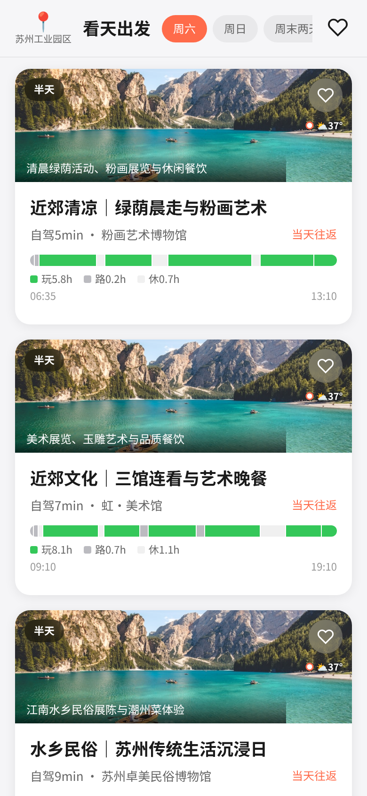
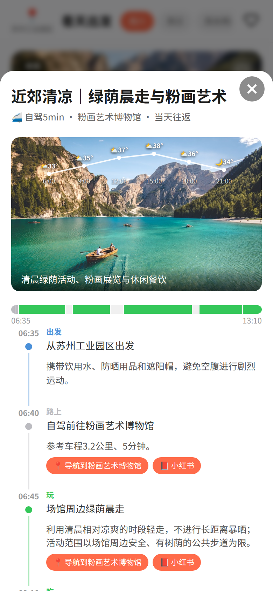

- 换模型：GPT-5.5 → GPT-5.6-sol（更强推理）
- 行程连续性强制（住一晚的方案不能中途回家）
- 多交通方式成本写进 prompt
- 经验类型多样化（古镇/湖景/远途/漂流/山林）
- 最终版 20 个方案，打 tag **v0.1.0-alpha**
- **反思**：再怎么调 prompt 和模型，生成的内容都没有种草力

### 阶段九：Pivot — 用户素材 + AI 整理（今天上午）

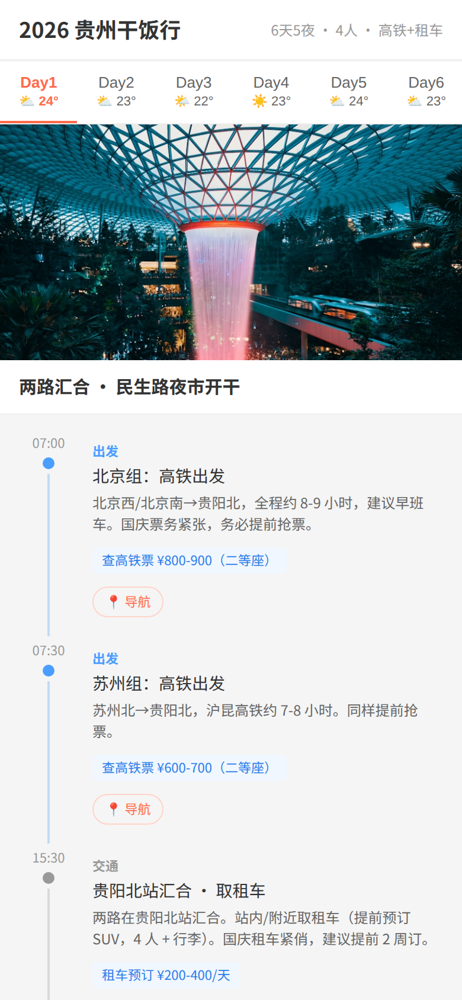
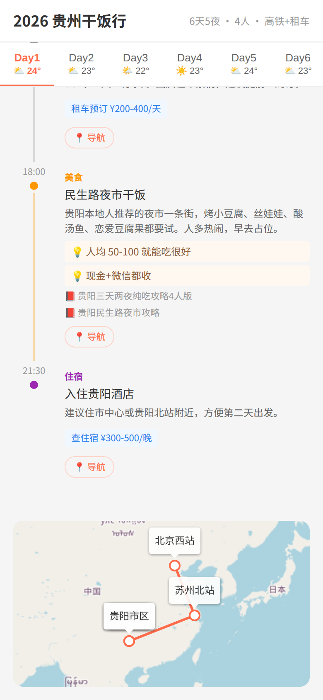

- 核心洞察：好内容来自人类，AI 的价值在整理不在生成
- 用户扔截图 → 多模态提取 → 高德 API 验证 → 方案页
- 贵州行程 MVP：10 张截图 → 6 天完整方案
- 真实小红书链接、历史天气（Open-Meteo）、精确坐标
- 频道即产品：#kantian-travel 本身就是入口

### 阶段十：反思 — 赛道本身的问题（今天下午）

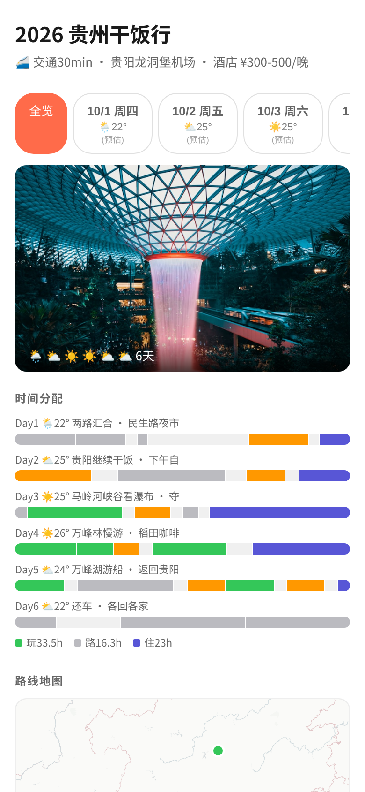
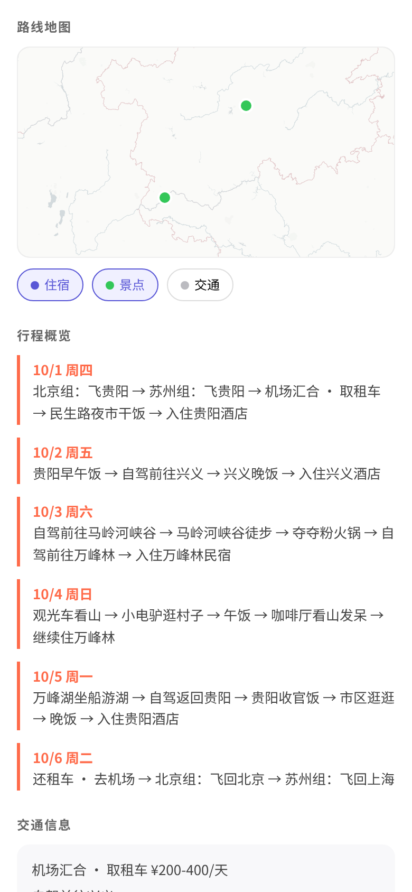

- 旅行规划赛道天花板很低
- 种草靠视觉冲击，AI 做不到
- "规划"本身 15 分钟搞定，不是痛点
- 产品方向需要重新思考

## 有价值的沉淀

虽然产品方向可能不成立，但这段时间的产出不白费：

1. **"频道即产品"** — 任何场景都可以是一个调教好的频道，不需要独立 app
2. **截图→结构化提取→可执行输出** — 能力链路可复用到其他场景
3. **实时数据叠加（天气/交通 API）** — AI 真正比人强的地方
4. **对 AI 内容生成边界的认知** — 知道什么该让人做、什么该让 AI 做
5. **完整的 UI 组件库** — 甘特图、时间轴、地图、导航按钮，下个项目可复用
6. **产品判断力** — 下次选方向先问：没有 AI 时人怎么做？花多久？痛不痛？如果"15 分钟搞定，不太痛"——别做了。

## 一句话

**好的攻略平台来自高质量的内容，不是工具能力。AI 不该做内容生产，该做人做不了或懒得做的事。**
